# Actividad 5: Explorando diferentes formas de fusionar en Git

## Ejemplos

### Fusión fast-forward

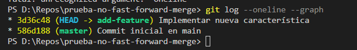

### Fusión no-fast-forward

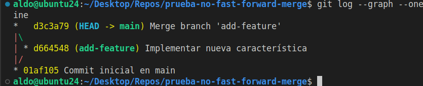

### Fusión squash

Nuestra rama add-basic-files tiene dos commits:
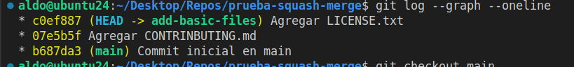

Tras hacer el merge squash y pasar de vuelta a la rama main, parece que perdimos commits de la rama feature, pero en realidad están en el directorio de trabajo.

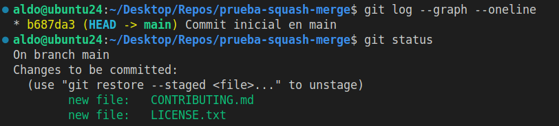

De esta forma el siguiente commit que hagamos puede contener todos estos cambios que fuimos almacenando en diferentes commits en la rama feature:

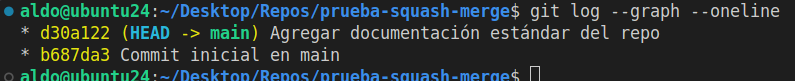

## Preguntas

### git merge --ff

¿En qué situaciones recomendarías evitar el uso de git merge --ff? Reflexiona sobre las desventajas de este método.

El comando git merge --ff, o simplemente git merge, es la fusión más fácil de hacer, pero su utilidad se limita a proyectos pequeños o individuales. De hecho, en este contexto, rara vez se necesita hacer una fusión, ya que los cambios son secuenciales.

### git merge --no-ff

¿Cuáles son las principales ventajas de utilizar git merge --no-ff en un proyecto en equipo? ¿Qué problemas podrían surgir al depender excesivamente de commits de fusión?

Usar este comando permite a un equipo de desarrollo tener una visión clara de la evolución del proyecto cuando este ya no es tan pequeño. Esto es lo que llamamos trazabilidad.

### git merge --squash

¿Cuándo es recomendable utilizar una fusión squash? ¿Qué ventajas ofrece para proyectos grandes en comparación con fusiones estándar?

Cuando el proyecto evoluciona en incrementos muy pequeños, tener un historial de todos esos cambios pequeños de hecho dificulta la visión de la evolución del proyecto. Y esto sucede comúnmente cuando se trabaja bajo la metodología DevOps o Agil. Ahí es donde lo que buscamos es condensar nuestros commits para tener una visión clara de la evolución del proyecto a pesar de los cambios tan numerosos que todo el equipo realiza conjuntamente.

## Resolver conflictos en una fusión no-fast-forward

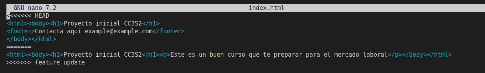

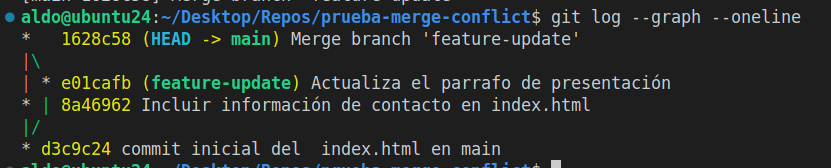

¿Qué pasos adicionales tuviste que tomar para resolver el conflicto?

Primero, tuve que salir del anterior repositorio con `cd ..` porque Git tiene problemas con los repositorios anidados.

Luego, como tuve que dejar a medias esta parte durante un tiempo, para recordar cómo estaban las cosas usé el comando `git status`. Ahí recordé que estaba en la rama main y que ya había resuelto el conflicto, pero todavía no había pasado el archivo al staging ni había hecho el commit para la fusión de ambas ramas.

¿Qué estrategias podrías emplear para evitar conflictos en futuros desarrollos colaborativos?

Separando el trabajo en ramas que se concentren en partes distintas del código. Hablando con mis compañeros para que decidamos qué partes del código tocará cada uno.

## Ejercicios

### Comparar los historiales

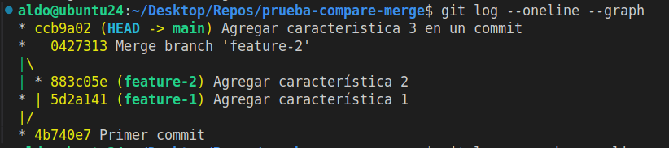

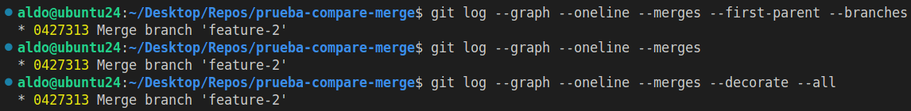

### Fusión automática y revertir fusión

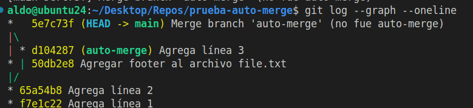

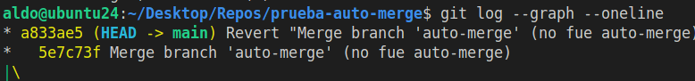

¿Cuándo usarías un comando como git revert para deshacer una fusión?

Lo usaría para deshacer una fusión cuando ya fue aplicada y compartida a un repo remoto con push, o cuando mis compañeros ya basaron su trabajo en mi fusión.

¿Qué tan útil es la función de fusión automática en Git?

La fusión automática es muy útil si la sabemos aprovechar en equipo al delegar tareas que no modifiquen las mismas partes de nuestro código. Cada quien debe trabajar en un sección o un archivo distinto para evitar conflictos.

### Fusión remota

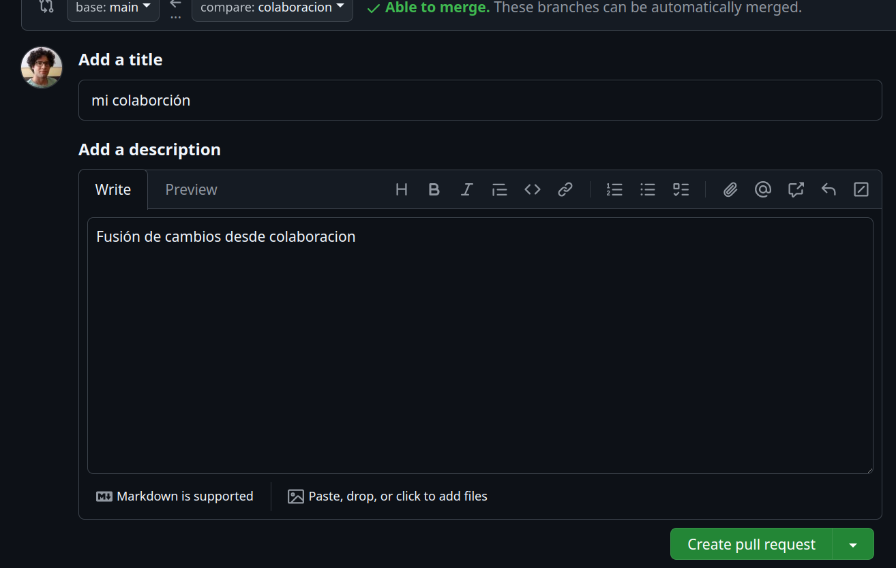

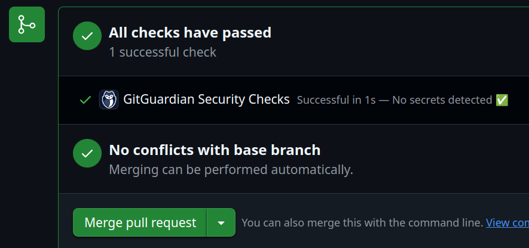

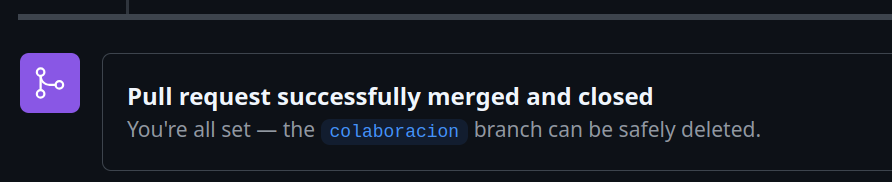

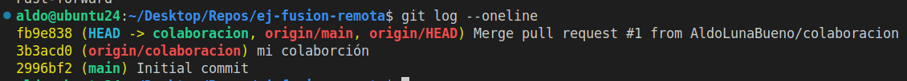

¿Cómo cambia la estrategia de fusión cuando colaboras con otras personas en un repositorio remoto?

Cuando colaboras con otros en un repo remoto ya no basta con empujar tu merge: tienes que hacer el esfuerzo de entender lo que están haciendo los demás y de explicar con base en ello por qué sería bueno incluir tu cambio en la rama principal o de integración. De hecho, en un proyecto colaborativo probablemente no tengas los permisos para hacer una fusión directa. Entonces, la estrategia es proponer cambios comunicándonos efectivamente y promover la revisión del código antes de integrar los cambios. Esta estrategia en GitHub, que es la plataforma para colaborar en repos remotos, se maneja con el Pull Request.

¿Qué problemas comunes pueden surgir al integrar ramas remotas?

El mayor problema al integrar ramas es que surjan conflictos de integración, es decir, que la rama principal y la rama con nuestros cambios modifiquen las mismas partes del código. Esto puede por varios motivos y es parte del flujo natural del trabajo, pero lo que hay que hacer siempre para evitar conflictos innecesarios es tener nuestro repo local al día con lo último del repo remoto.

Otra cosa que puede suceder es que quien tienen los permisos para decidir finalmente si va o no va nuestro cambio no esté pendiente. La persona a cargo debe ser responsable y muy activa.

### Ejercicio final: flujo de trabajo completo

Desde la rama feature3:

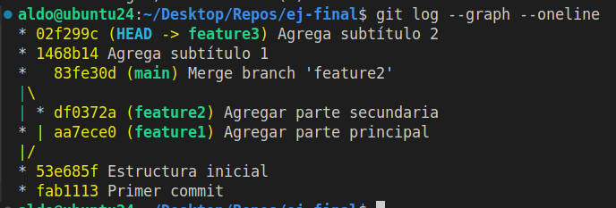

Desde la rama principal luego de hacer la fusión squash:

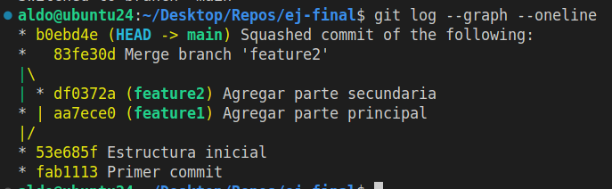

En el historial se puede observar que la fusión de feature1 con --ff no genera un nuevo commit: la rama feature1 simplemente se incorpora directamente a main, como si siempre hubiera sido parte de ella. Esto hace el historial más lineal.

En el caso de la fusión de feature2 con --no-ff sí genera un commit de fusión, y esto preserva la información de que fue una rama separada y desde qué punto partió. Muy útil para la trazabilidad de los cambios.

Y en el caso de la fusión de feature3 con --squash vemos que ni siquiera hay una referencia a que los cambios vienen de una rama. Es como si los cambios se hubieran hecho directamente desde main, y de hecho así fue. Todos los cambios que se hicieron en la rama feature3 se copiaron al staging de la rama principal listos para hacer el commit y guardarlos desde main. La rama feature3 sigue existiendo, pero no figura como contribuyente de la rama principal. Esto mantiene un historial muy limpio y claro de los cambios, pero deja mucho que desear en cuanto a la trazabilidad del proyecto.

Este es el resultado final de las tres contribuciones:

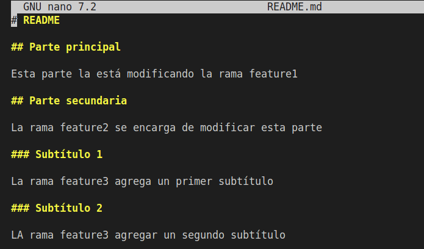
