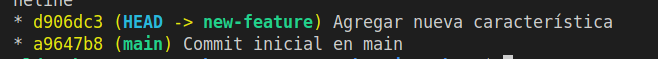
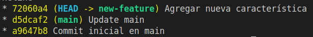
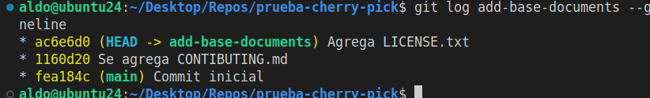
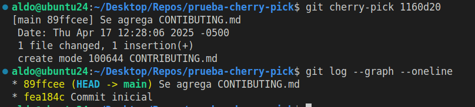

# Actividad 6: Reabase, Cherry-Pick y CI/CD en un entorno ágil

## Parte 1: git rebase para mantener un historial lineal

## Parte 2: cherry-pick

Ahora tanto en la rama principal como en la rama add-base-documents se tiene guardado el cambio correspondiente a la creación del archivo CONTRIBUTING.md con el mismo mensaje, pero con código de commit distinto:

- add-base-documents: **1160d20** (el commit original)
- main: **89ffcee** (el commit cherry-picked)

### Preguntas

¿Por qué se considera que rebase es más útil para mantener un historial de proyecto lineal en comparación con merge?

El comando rebase permite reubicar commits sobre la base de otra rama, como si se hubieran creado directamente desde ahí.

¿Qué problemas potenciales podrían surgir si haces rebase en una rama compartida con otros miembros del equipo?

Hacer rebase en una rama compartida reescribe su historia en tu repo local, pero al empujar esa rama, tus compañeros tendrán un conflicto al jalar tu actualización. Esto puede ser mu confuso.

¿En qué se diferencia cherry-pick de merge, y en qué situaciones preferirías uno sobre el otro?

La fusión, sobre todo con --no-ff, mantiene el contexto de los cambios hechos por un colaborador.

El cherry-pick copia un commit específico de otra rama y lo aplica sobre la actual, sin mantener el registro histórico.

¿Por qué es importante evitar hacer rebase en ramas públicas?

Porque reescribes commits que otros ya tienen, provocas desincronización, y obligas a todos los que usen esa rama a hacer un git pull --rebase. Es mejor evitar esto y nunca hacer rebase sobre ramas públicas.

### Ejercicios teóricos

**Diferencias entre git merge y git rebase.** Explica la diferencia entre git merge y git rebase y describe en qué escenarios sería más adecuado utilizar cada uno en un equipo de desarrollo ágil que sigue las prácticas de Scrum.

En Scrum, un rebase se usa sobre tu rama privada para luego hacer merge a la principal. Esto permite resolver conflictos innecesarios. En este contexto es común usar git merge --squash porque se aplican cambios a un ritmo muy grande, pero si la frecuencia no es tan elevada y la rama tiene varios cambios que no se puede reducir a una sola cosa, es mejor usar git merge --no-ff pra dejar rastro de los cambios en su contexto.

**Relación entre git rebase y DevOps.** ¿Cómo crees que el uso de git rebase ayuda a mejorar las prácticas de DevOps, especialmente en la implementación continua (CI/CD)? Discute los beneficios de mantener un historial lineal en el contexto de una entrega continua de código y la automatización de pipelines.

Los beneficios del git rebase son dos: el historial limpio y lineal, ya que no pierde la trazabilidad, y la reducción de los conflictos en producción, ya que tu rama privada actualiza su commit base a la última versión de la rama principal reducciendo los conflictos.

**Impacto del git cherry-pick en un equipo Scrum.** Un equipo Scrum ha finalizado un sprint, pero durante la integración final a la rama principal (main) descubren que solo algunos commits específicos de la rama de una funcionalidad deben aplicarse a producción. ¿Cómo podría ayudar git cherry-pick en este caso? Explica los beneficios y posibles complicaciones.

### Ejercicios prácticos

#### Simulación de un flujo de trabajo Scrum con git rebase y git merge

