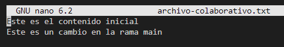

# Actividad 6: Reabase, Cherry-Pick y CI/CD en un entorno ágil

## Parte 1: git rebase para mantener un historial lineal


En la siguiente captura del historial se puede apreciar que el commit de la rama feature ya no tiene como base al primer commit de la rama main (a9647b8), sino a la última actualización (d5dcaf2).


## Parte 2: cherry-pick


Ahora tanto en la rama principal como en la rama add-base-documents se tiene guardado el cambio correspondiente a la creación del archivo CONTRIBUTING.md con el mismo mensaje, pero con código de commit distinto:

- add-base-documents: **1160d20** (el commit original)
- main: **89ffcee** (el commit cherry-picked)

### Preguntas

**Pregunta.** ¿Por qué se considera que rebase es más útil para mantener un historial de proyecto lineal en comparación con merge?

El comando rebase permite reubicar commits sobre la base de otra rama, como si se hubieran creado directamente desde ahí.

**Pregunta.** ¿Qué problemas potenciales podrían surgir si haces rebase en una rama compartida con otros miembros del equipo?

Hacer rebase en una rama compartida reescribe su historia en tu repo local, pero al empujar esa rama, tus compañeros tendrán un conflicto al jalar tu actualización. Esto puede ser mu confuso.

**Pregunta.** ¿En qué se diferencia cherry-pick de merge, y en qué situaciones preferirías uno sobre el otro?

La fusión, sobre todo con --no-ff, mantiene el contexto de los cambios hechos por un colaborador.

El cherry-pick copia un commit específico de otra rama y lo aplica sobre la actual, sin mantener el registro histórico.

**Pregunta.** ¿Por qué es importante evitar hacer rebase en ramas públicas?

Porque reescribes commits que otros ya tienen, provocas desincronización, y obligas a todos los que usen esa rama a hacer un git pull --rebase. Es mejor evitar esto y nunca hacer rebase sobre ramas públicas.

### Ejercicios teóricos

**Diferencias entre git merge y git rebase.** Explica la diferencia entre git merge y git rebase y describe en qué escenarios sería más adecuado utilizar cada uno en un equipo de desarrollo ágil que sigue las prácticas de Scrum.

En Scrum, un rebase se usa sobre tu rama privada para luego hacer merge a la principal. Esto permite resolver conflictos innecesarios. En este contexto es común usar git merge --squash porque se aplican cambios a un ritmo muy grande, pero si la frecuencia no es tan elevada y la rama tiene varios cambios que no se puede reducir a una sola cosa, es mejor usar git merge --no-ff pra dejar rastro de los cambios en su contexto.

**Relación entre git rebase y DevOps.** ¿Cómo crees que el uso de git rebase ayuda a mejorar las prácticas de DevOps, especialmente en la implementación continua (CI/CD)? Discute los beneficios de mantener un historial lineal en el contexto de una entrega continua de código y la automatización de pipelines.

Los beneficios del git rebase son dos: el historial limpio y lineal, ya que no pierde la trazabilidad, y la reducción de los conflictos en producción, ya que tu rama privada actualiza su commit base a la última versión de la rama principal reducciendo los conflictos.

**Impacto del git cherry-pick en un equipo Scrum.** Un equipo Scrum ha finalizado un sprint, pero durante la integración final a la rama principal (main) descubren que solo algunos commits específicos de la rama de una funcionalidad deben aplicarse a producción. ¿Cómo podría ayudar git cherry-pick en este caso? Explica los beneficios y posibles complicaciones.

### Ejercicios prácticos

#### 1. Simulación de un flujo de trabajo Scrum con git rebase y git merge


Después de la fusión --ff-only:


#### 2. Cherry-pick para integración selectiva en un pipeline CI/CD

El historial de la rama feature antes de los cherry-pick.


Con cherry-pick logramos mover los dos commits de la rama feature a la rama principal. Pudimos mover solo uno de ellos, y este es el gran poder de este comando: la **precisión**.


## Git, Scrum y Sprints. Fases del sprint, CI/CD

### 1. Planificación del sprint

Creamos dos ramas:


¿Por qué es importante trabajar en ramas de funcionalidades separadas durante un sprint?

Trabajar en ramas de funcionalidades separardas permite trabajar en paralelo sobre esas funcionalidades y de forma aislada, ya que hasta que se haga el merge el desarrollador que se encarga de una rama no se tiene que preocupar del trabajo que se hace en las otras ramas hasta que tenga que termine y haga la fusión. Esto aumenta la velocidad de desarrollo, siempre y cuando los cambios no sean muy grandes.

### 2. Desarrollo del sprint


**Pregunta.** ¿Qué ventajas proporciona el rebase durante el desarrollo de un sprint en términos de integración continua?

La principal ventaja de hacer un rebase de una rama de trabajo sobre la rama principal es que esto garantiza que la rama de trabajo esté alinieada con la versión más reciente del código de producción o integración en la rama principal. Cualquier conflicto que se detecte se va a resolver dentro de la rama de trabajo, y no en la rama principal.

Una consecuencia de esto es que se genera un historial más fácil de leer y depurar, lo que mejora el seguimiento y trazabilidad de los cambios durante los sprints. Además, en nuestro pipeline CI/CD, si la rama rebased ya está probada contra el código actual de main, es menos probable que el pipeline falle al hacer merge.

### 3. Revisión del sprint


Vemos que el commit listo para la revisión en la rama main es el 2f26f3c, así que este será el commit cherry-picked por ahora.


El commit cherry-picked ahora figura con el mismo mensaje como si se hubiera hecho desde la misma rama main, solo que con otro identificador.

**Pregunta.** ¿Cómo ayuda git cherry-pick a mostrar avances de forma selectiva en un sprint review?

En lugar de fusionar toda la rama, git cherry-pick nos permite seleccionar solo los commits listos y estables. Esto es muy importante en un sprint review porque el equipo puede ver claramente qué se logró y qué no, y no arriesgas el entorno de demo o producción integrando código incompleto.

### 4. Retrospectiva del sprint


**Pregunta.** ¿Cómo manejas los conflictos de fusión al final de un sprint? ¿Cómo puede el equipo mejorar la comunicación para evitar conflictos grandes?

Si el conflicto es menor, se puede resolver en el mismo momento en el que se detecta al hacer el merge. Si es un conflicto importante durante la integración, esta puede pasarse al siguiente sprint mientras se resuelven los conflictos para no entorpecer la entrega del resto.

### 5. Automatización de integración continua

> Aquí no buscamos hacer un rebase de main sobre feature, sino un rebase de feature sobre main, ya que la base de la rama feature es la que se reposiciona hacia el cambio más reciente en main. **Ojo a la sintaxis.**

Como vamos a automatizar el rebase de una rama feature sobre la rama remota de main origin/main, previamente necesitamos subir este proyecto scrum-project a un repo remoto en GitHub.


Ahora el punto de partida de la rama feature se reubicó en el último commit de la rama main gracias al hook que definimos:


**Pregunta.** ¿Qué ventajas y desventajas observas al automatizar el rebase en un entorno de CI/CD?

Automatizar el rebase sobre main facilita todas las ventajas del rebase: historial limpio y lineal, detección temprana de conflictos y entrega continua sin bloqueos cuando incluimos pruebas automatizadas.

## Navegando conflictos y versionado en un entorno devOps

Tras `git checkout --ours archivo-colagorativo.txt`, se hizo la fusión y no se observó conflicto. El cambio que quedó fue el de la rama principal, pues desde ahí hicimos el `git checkout --ours`.




### Preguntas contextualizadas

**Pregunta git checkout.** ¿Cómo utilizarías los comandos git checkout --ours y git checkout --theirs para resolver este conflicto de manera rápida y eficiente?

Ante todo, los comandos no importan. Lo más importante es que los equipos A y B se comuniquen y logren decidir cuál cambio en el archivo de configuración se queda. Si el archivo de configuración es, por ejemplo, `config.yml`, lo que se hace después es `git checkout --ours config.yml` si quien resuelve el conflicto es quien tiene el cambio acordado, o `git checkout --theirs config.yml` si es al contrario.

**Pregunta git diff.** Utilizando el comando git diff, ¿cómo compararías los cambios entre ramas para identificar diferencias específicas en archivos críticos?

```bash
git diff main..feature-branch
```

Este comando, por ejemplo, nos muestra qué cambiaría si se fusionara main sobre feature-branch, es decir, los cambios introducidos por feature-branch que no están en main. Su resultado se ve así:


Si lo que se busca es filtrar por archivos críticos, el comando se puede adaptar a esto:

```bash
git diff main..feature-branch -- archivo-colaborativo.txt
```

(En nuestro caso, la salida es la misma porque no tenemos más archivos con diferencias, así que la omitimos).

**Pregunta git merge.** Describe cómo usarías el comando git merge --no-commit --no-ff para simular una fusión en tu rama local.

La útilidad de este comando es que no crea el commit automáticamente, lo que te permite revisar los cambios localmente, ejecutar pruebas y resolver conflictos sin presionar hacer commit aún. Además, no usa fast-forward, así que el historial de cambios de la rama feature queda registrado.

Si lo que queremos es automatizar el proceso, con prueba incluida, se puede hacer por ejemplo este hook de pre-merge:

```bash
#!/bin/bash
# .git/hooks/pre-merge
git fetch origin
git checkout main
git merge --no-commit --no-ff origin/dev-branch
npm test
```

**Pregunta git mergetool.** ¿Cómo configuras git mergetool para que el equipo use herramientas visuales como code o vimdiff?

Para usar, por ejemplo, VS Code en Ubuntu, hacemos lo siguiente:

```bash
git config --global merge.tool code
git config --global mergetool.code.cmd "code --wait $MERGED"
```

Pero, si lo hacemos en Windows, hay que modificar ligeramente el segundo comando:

```bash
git config --global mergetool.code.cmd 'code --wait \"$MERGED\"'
```

Y, cuando se presente un conflicto, solo tenemos que ejecutar `git mergetool` y el archivo en conflicto se abrirá en nuestra herramienta favorita:


Si se generan archivos de recuperación (.orig), hay que ejecutar ``git clean -f`` para limpiarlo, ya que son archivos basura.

**Pregunta git reset** ¿Cuándo y por qué usar git reset --mixed para deshacer un commit que rompe la CI sin perder cambios?

Cuando queremos arreglar los cmabios que rompen la CI antes de hacer push. Por ejemplo, para revertir el último commit y dejar el código en el editor (en el directorio de trabajo), usamos:

```bash
git reset --mixed HEAD~1
```

Si usaramos --soft mantendríamos los efectos en los archivos, pero también mantendríamos el efecto en el staging, y no queremos eso. Y, si usaramos --hard, borraríamos los efectos en los archivos.

**Pregunta git revert.** ¿Cómo revertir commits en producción sin reescribir el historial?

Para revertir un solo commit:

```bash
git revert "un solo commit"
```

Para revertir varios commits:

```bash
git revert HEAD~2..HEAD
```

De esta manera se crea un nuevo commit que deshace los anteriores en el cambio más reciente de la rama, pero no borra el historial. Esto a veces es la única opción cuando el repositorio es protegido y no tenemos los privilegios para borrar el historial.

**Pregunta git stash.** ¿Cómo pausar tus cambios cuando debes atender un hotfix urgente?

Si estamos en una rama feature haciendo cambios que todavía no hemos guardado y tenemos que atender un hotfix urgente, guardamos nuestros cambios en una memoria temporal que maneja git, arreglamos el bug, volvemos a feature y sacamos de esa memoria lo que guardamos antes. Esta memoria es como una pila.

```bash
git stash
git checkout hotfix-branch
# Trabajo en el hotfix
git checkout feature
git stash pop
```

Opcionalmente, si no queremos correr el riesgo de olvidarnos del cambio que tenemos en el stash, podemos hacer el push con un mensaje, como si hicieramos un commit:

```bash
git stash push -m "WIP: feature X"
# (WIP: Working In Progress)
```

Esto nos ayuda cuando necesitamos trabajar en múltiples tareas con interrupciones frecuentes.

Y también lo podemos automatizar con unj hook de pre-checkout si las interrupciones son demasiado frecuentes en neustro flujo de trabajo:

```bash
#!/bin/bash
# .git/hooks/pre-checkout
git stash --include-untracked
```

**Pregunta gitignore.** ¿Cómo construir un .gitignore efectivo para un entorno ágil con CI/CD?

Siempre se necesita instalar paquetes o módulos (usaremos el ejemplo de node), pero estos paquetes se pueden enlistar para que se instalen automáticamente con un comando (npm install). Varios equipos trabajando sobre la misma base de código puede suponer una variedad de configuraciones de entorno y también diferentes herramientas de desarrollo, pero en un entorno solo se necesita una configuración de entorno, no todas. Los desarrolladores pueden estar trabajando en diferentes sistemas operativos y a veces se crean archivos o carpetas especiales que solo valen para ese sistema operativo en concreto. Queda justificado entonces que estas informaciones no se debería guardar en un repositorio compartido por todos, así que hay que **ignorar** todo esto así:

```text
# Paquetes
node_modules

# Archivos de entorno
.env
.env.local
.env.*

# Configs personales
.vscode/
.idea/

# Sistemas operativos
.DS_Store
Thumbs.db
```

Este archivo .gitignore debe ser compartido por todos quienes trabajen con su respectiva base de código.

### Ejercicios adicionales

**Pregunta git merge.** ¿Cómo gestionarías la resolución de este conflicto de manera eficiente utilizando Git y manteniendo la entrega continua sin interrupciones? ¿Qué pasos seguirías para minimizar el impacto en la CI/CD y asegurar que el código final sea estable?

Depende del tamaño del equipo. Si el equipo es pequeño y hay una buena comunicación, simplemente los responsables de los cambios en conflicto conversan y quien hizo el cambio que generó el conflicto lo resuelve según lo acordado en la conversación. Para esto es muy útil hacer un Pull Request en GitHub, ya que ahí la conversación queda registrada en comentarios y se puede hacer revisión del código.

Si el equipo es grande, habrá un mecanismo para derivar el conflicto a un líder técnico. Esta persona creará una rama de resolución de conflictos (conflict-resolution) para reunir ambos cambios en conflicto y darles solución teniendo en cuenta el propósito detrás de ambos cambios:

```bash
git checkout -b conflict-resolution/feature1-vs-feature2
```

Primero se testean los cambios localmente y luego en un entorno de integración (develop, staging...)

Se ejecuta nuevamente el pipeline CI en la rama de resolución. Solo si pasa todas las pruebas, se fusiona a la rama principal main.

Opcionalmente, si el conflicto fue difícil, se puede hacer retroalimentación de este evento con ambos equipos para evitar futuros conflictos en archivos críticos.

**Pregunta rebase vs merge.** ¿Qué ventajas y desventajas presenta cada enfoque (merge vs. rebase) en el contexto de la metodología ágil? ¿Cómo impacta esto en la revisión de código, CI/CD, y en la identificación rápida de errores?

La ventaja del rebase es que permite tener un historial lineal y limpio, mientras que la ventaja de merge es que preserva el historial completo con todos los cambios y su contexto. La desventaja más grande de rebase es que hay mayor riesgo de reescribir la historia de una rama pública, mientras que la desventaja de merge es que puede volverse difícil la lectura durante las revisiones dependiendo de la cantidad de cambios que se hagan.

**Pregunta Git Hooks.** Diseña un conjunto de Git Hooks que ayudaría a mitigar estos problemas, integrando validaciones de estilo y tests automáticos antes de permitir los commits. Explica qué tipo de validaciones implementarías y cómo se relaciona esto con la calidad del código y la entrega continua en un entorno ágil.

El más importante es el hook de pre-commit. Aquí podemos hacer validaciones de estilo y pruebas unitarias:

```bash
#!/bin/bash
# .git/hooks/pre-commit
echo "Ejecutando pre-commit..."
npm run lint || exit 1
npm test || exit 1
```

Esto por supuesto que mejora la calidad porque impedirá que el código roto o no estilado correctamente se guarde como un commit en un lugar importante como una rama de integración.

Para este caso concreto, si cualquiera de las pruebas falla, el hook devuelve un valor distinto de 0 (aquí devuelve 1), y esto cancela la operación que se iba a realizar a continuación, que aquí es un commit.

**Pregunta branching.** Explica cómo adaptarías o modificarías la estrategia de branching para optimizar el flujo de trabajo del equipo en un entorno ágil y con integración continua. Considera cómo podrías integrar feature branches, release branches y hotfix branches de manera que apoyen la entrega continua y minimicen conflictos.

Primero vamos a definir y describir las diferentes ramas:

- main: rama estable y desplegable para producción
- feature/*: ramas cortas que se fusionan rápido
- hotfix/*: ramas solo si hay emergencia en producción
- realease/*: opcional solo en versiones mayores.

Para la integración hacemos rebase de feature/* sobre main antes de fusionar con merge. Usamos la opción --squash o --ff de merge para terminar con ramas lineales, que es lo que se busca en primer lugar al usar rebase.

Para automatizar la validación se usan Pull Requests con integración automática mediante GitHub Actions.

De esta manera tenemos integraciones rápidas, con menos conflictos y con entregas más continuas.

**Pregunta revert y reset.** ¿Cómo diseñarías un proceso automatizado con Git y CI/CD que permita revertir cambios de manera eficiente y segura? Describe cómo podrías integrar comandos como git revert o git reset en la pipeline y cuáles serían los pasos para garantizar que los bugs se reviertan sin afectar el desarrollo en curso.

El objetivo de este proceso es mantener la estabilidad del sistema cuando se detecta un bug crítico durante la integración continua, es decir, antes del despliegue a producción. Esto significa que la automatización propuesta no necesita revertir cambios ya desplegados, sino mantener la estabilidad de la rama principal y evitar que los errores avancen en el flujo de despliegue.

Lo que buscamos es un mecanismo automatizado que, ante la detección temprana de errores críticos, haga lo siguiente:

1. Revierte de forma segura los commits con errores sin romper los avances en la rama principal.
2. No bloquea el trabajo del equipo de desarrollo.
3. Minimiza el riesgo de reintroducir errores debido a la acción humana.

El sistema primero identifica los commits que fueron incluidos en el merge o push que falló. Si solo uno o varios commits recientes fallan y no hay commits posteriores que dependan de estos, se considera su reversión.

```bash
git revert "todos los commits que fallan"
```

Esto crea uno o más commits con la reversión y los sube automáticamente a la rama main o a una rama temporal auto-revert/*, o similar.

Si no es posible revertir con seguridad porque el commit fallido ya es una base para otros, se bloquea el merge o despligue y se escala el problema al equipo técnico o al líder técnico en lugar de automatizar la reversión.

El proceso no hace `git reset` en ramas compartidas, ya que es destructivo y peligroso en entornos colaborativos.

Si el bug fue detectado tarde (ya en producción), se puede hacer rollback automático al tag de la versión previa estable. Esta acción puede hacerse desde una rama hotfix/* basada en el tag.
