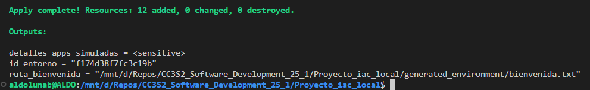

# Actividad: Orquestador local de entornos de desarrollo simulados con Terraform

Acerca de los requisitos, para futura referencia, instalé Terraform siguiendo [el procedimiento oficial de HashiCorp](https://developer.hashicorp.com/terraform/tutorials/aws-get-started/install-cli#install-terraform).


Según la guía, para crear y configurar todos los recursos simulados definidos por este proyecto, debemos de ejecutar los siguientes comandos de Terraform desde la carpeta raíz:

```bash
terraform init
terraform plan # opcional
terraform apply
```

Como estoy usando WSL en Windows, en _./main.tf_ cambié la ruta por defecto de la variable "python_executable" a "/usr/bin/python3". Sin embargo, luego de ejecutar ``terraform apply`` surgieron varios errores no contemplados en la guía.

Los archivos tenían caracteres ocultos '\r' debido a que estos archivos venían de un sistema que usa Windows. Esto es un problema porque al parecer Bash no es capaz de leer bien los archivos .sh si tiene estos caracteres de retorno de carro.

Al correr en Linux o WSL, hay que quitarlos. En VS Code la forma más fácil de hacer esto es cambiando de CRLF a LF en su banda azulada inferior a la derecha.


Luego hay que asegurarse de que el comando mkdir tenga el flag "-p", ya que en Linux no se puede crear un directorio si su padre no existe a menos que se use el flag "-p". Por ejemplo, aquí:

```hcl
provisioner "local-exec" {
    command = "mkdir -p ${var.base_path}/${var.nombre_entorno_modulo}_data"
}
```

Esto fue suficiente para generar y configrar los recursos definidos en el proyecto:



Además, vemos los siguientes outputs:

- ```bash
    terraform output id_entorno
    ```
    ```txt
    "4d2e9d55fe6e5cc5"
    ```

-   ```bash
    terraform output ruta_bienvenida
    ```

    ```txt
    "/mnt/d/Repos/CC3S2_Software_Development_25_1/Proyecto_iac_local/generated_environment/bienvenida.txt"
    ```

-   ```bash
    terraform output detalles_apps_simuladas
    ```

    ```hcl
    {
        "app1" = {
            "config_path" = "/mnt/d/Repos/CC3S2_Software_Development_25_1/Proyecto_iac_local/generated_environment/services/app1_v1.0.2/config.json"
            "install_path" = "/mnt/d/Repos/CC3S2_Software_Development_25_1/Proyecto_iac_local/generated_environment/services/app1_v1.0.2"
            "metadata_id" = "fee68f45-73ea-4f20-8c8f-f35667d3df18"
        }
        "app2" = {
            "config_path" = "/mnt/d/Repos/CC3S2_Software_Development_25_1/Proyecto_iac_local/generated_environment/services/app2_v0.5.0/config.json"
            "install_path" = "/mnt/d/Repos/CC3S2_Software_Development_25_1/Proyecto_iac_local/generated_environment/services/app2_v0.5.0"
            "metadata_id" = "e434baef-2246-42cb-8b4e-dc57338d6362"
        }
    }
    ```

También podemos destruir los recursos:


-   ```bash
    terraform destroy
    ```

    ```txt
    Plan: 0 to add, 0 to change, 12 to destroy.

    Changes to Outputs:
    - detalles_apps_simuladas = (sensitive value) -> null
    - id_entorno              = "4d2e9d55fe6e5cc5" -> null
    - ruta_bienvenida         = "/mnt/d/Repos/CC3S2_Software_Development_25_1/Proyecto_iac_local/generated_environment/bienvenida.txt" -> null
    ```