# Introducción a Git

## Conceptos básicos de Git

Uso el comando git config para configurar mi nombre de usuario y correo para acceder a todos mis repositorios (modo global). También sirve para listar las variables de configuración, con git config --list

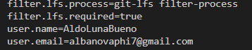

> Si no hago esto, Git no podrá guardar ningún cambio porque cada cambio (commit) se asocia a la identidad de quien realiza el cambio.
>
> 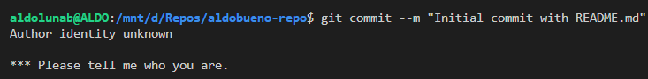

### Operaciones básicas

#### git init

Al inicializar el nuevo repositorio, se genera un directorio .git que se puede explorar en Windows activando la vista de elementos ocultos:

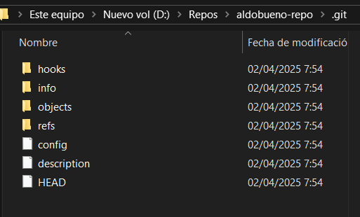

> Hay que evitar crear un repositorio dentro de otro repositorio, porque git da problemas.

#### git status

Creo un nuevo archivo llamado README.md. Mi archivo recién creado no está guardado en el historial, por lo que figura como untracked:

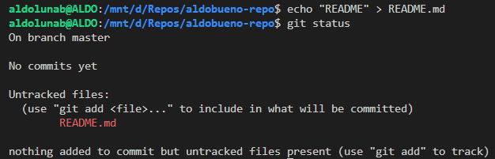

#### git add

Con este comando decido hasta qué punto rastrear mis cambios para luego guardarlos en el historial.

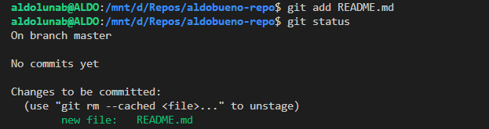

#### git commit

Pero aún no he guardado nada. Este comando sirve para guardar los cambios rastreados por git add en forma de un commit:

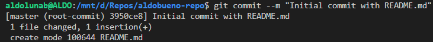

#### git log

Con este comando puedo ver el historial de commits y algunos detalles como el autor.

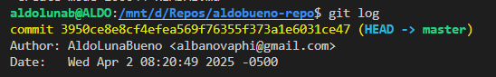

> Este comando me permitió darme cuenta de que había escrito mal mi correo en la configuración. Para arreglarlo usé git commit --amend (solo se puede para el último commit y si no ha sido pusheado a un repositorio remoto):
>
> 

Pregunta: ¿Cuál es la salida del siguiente comando?

`git log --graph --pretty=format:'%x09 %h %ar ("%an") %s'`

```
*        5a1d078 46 minutes ago ("AldoLunaBueno") Initial commit with README.md
```

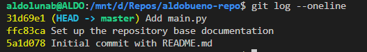

## Ejercicios

### Ejercicio 1

La primera línea del mismo documento es distinta en ambas ramas, y esto crea un conflicto cuando usamos git merge, el cual hay que resolver vanualmente.

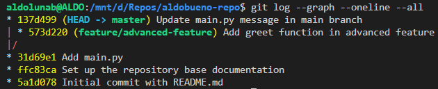

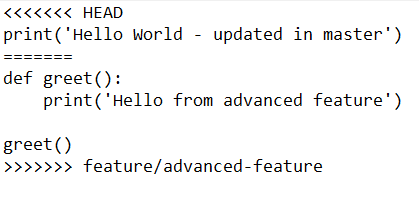

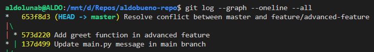

### Ejercicio 2

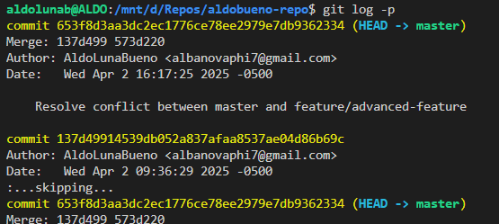

Para salir presionamos q.

Ahora vamoa a añadir un cambio a nuestro código que no deberíamos haber hecho.

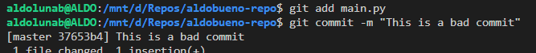

Si el cambio es tan sencillo como agregar una línea, podríamos revertirlo simplemente borrando esa línea y haciendo un nuevo commit, pero ¿qué tal si el cambio erróneo es más complejo? La mejor solución es usar el comando `git revert HEAD`.

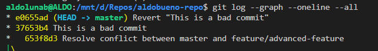

Como vemos, el commit erróneo que hicimos no desapareció, pero en el HEAD volvemos a tener la versión antes del cambio erróneo.

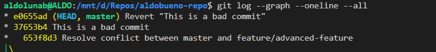

Para ver el git rebase en acción, simulamos commits que añaden en pasos una funcionalidad.

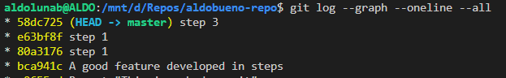

Queremos resumir estos pasos en un solo commit que refleje el cambio completo introducido por la funcionalidad. Por eso luego de usar git rebase solo usamos el mensaje del primer commit para que represente a todos (el primero con pick y los demás con squash o simplemente s).

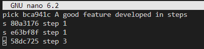

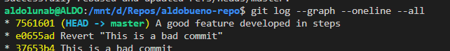

> Un comando git rebase mal ejecutado cambia el HEAD hacia el primer commit de los que iban a ser resumidos en uno solo.

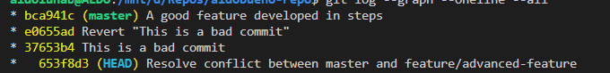

### Ejercicio 3

Creamos una nueva rama bugfix/rollback-feature desde el commit correspondiente a la creación del archivo main.py. 

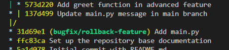

Intentamos hacer un merge entre esta rama y el HEAD, pero ocurre un conflicto debido a que en ambas se toca la misma pieza de código: la versión del HEAD tiene un desarrollo que no tiene la nueva rama, y esta nueva rama tiene la solución a un bug que no se llegó a resolver en HEAD. Por esta razón, el merge debe ser realizado manualmente.

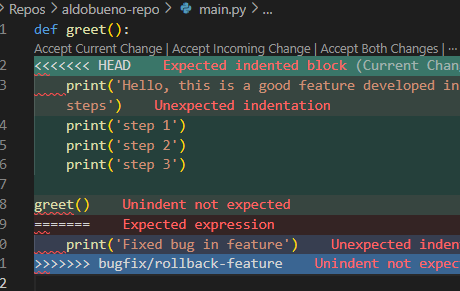

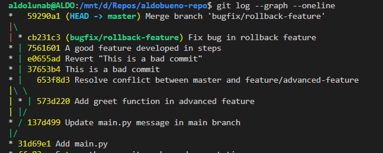

### Ejercicio 4

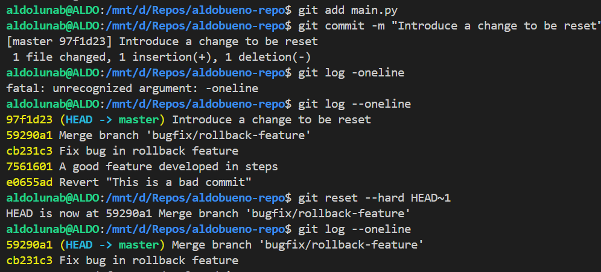

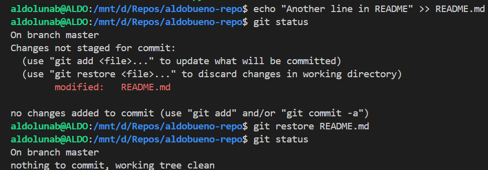

### Ejercicio 5

Primero clonamos el repositorio que llamamos repo_ej5_25_1. Está vacío. Esto es un problema, porque para crear una nueva rama se necesita un commit desde la cual esta cuelgue. Por eso creamos previamente el archivo que modificaremos después, collaboration.py, y guardamos este cambio como un nuevo commit.

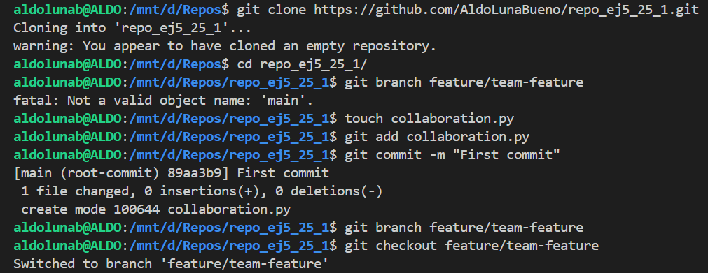

Ahora que se pudo crear la nueva rama feature/team-feature, que está ligada al último commit, hacemos un checkout para hacer cambios sobre esta.

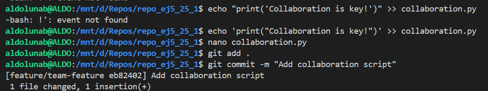

Cuando vamos a subir los cambios al repositorio remoto con git push, se presenta el siguiente problema:

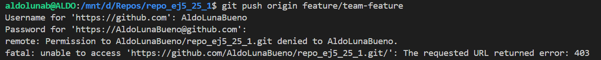

Esto no sucedería si el comando fuera ejecutado desde un entorno que se puede conectar al navegador, ya que desde ahí crearía un enlace para que al abrirlo me permita autenticarme en el sitio web mismo. Aquí, en WSL, tengo que copiar y pegar el token de acceso en la terminal.

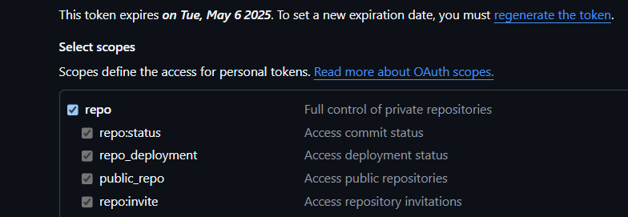

Y también hay que configurar el token para otorgar acceso a los repositorios.


Una vez subidos los cambios podemos ver en el repositorio remoto que solo hay una rama. ¿Por qué no aparece la rama main? Esto es porque solo hemos subido los cambios de la nueva rama, no de la rama main.

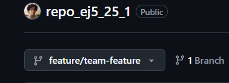

Pero para hacer el pull request de la nueva rama a la rama main necesitamos que aparezcan ambas en el repositorio remoto de GitHub, así que hacemos también git push origin main:

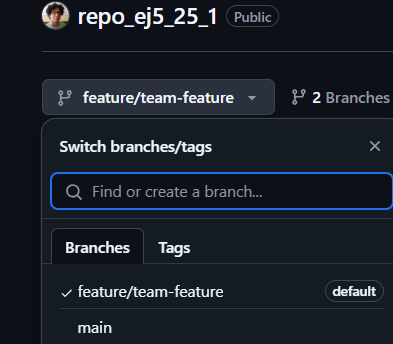

Aquí se puede ver el mismo archivo collaboration.py en su última actualización en ambas ramas en GitHub:


Para hacer el pull request seleccionamos las ramas apropiadas siguiendo la dirección de la flecha y, si dice *Able to merge*, podemos hacer el pull request.


Aquí añadimos un título (por defecto es el título del commit contenido en el pull request) y explicamos el pull request como si fuera la descripción de un commit.


Una vez hecho el PR, otros colaboradores o el autor pueden comentar, revisar y añadir actualizaciones al PR.

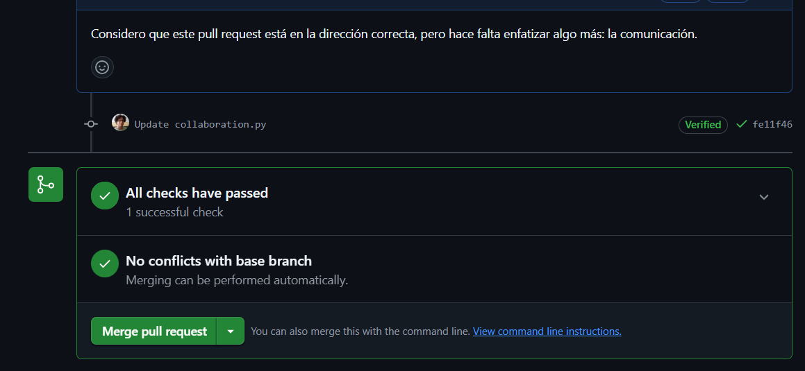

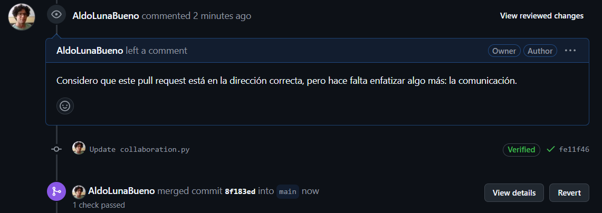

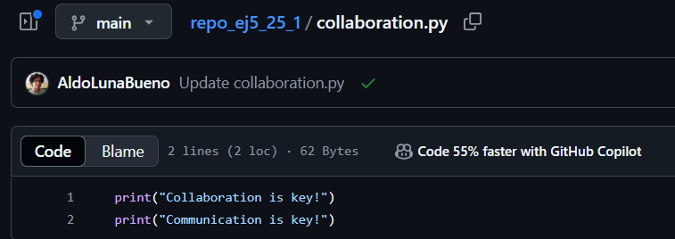