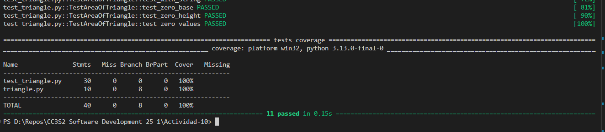
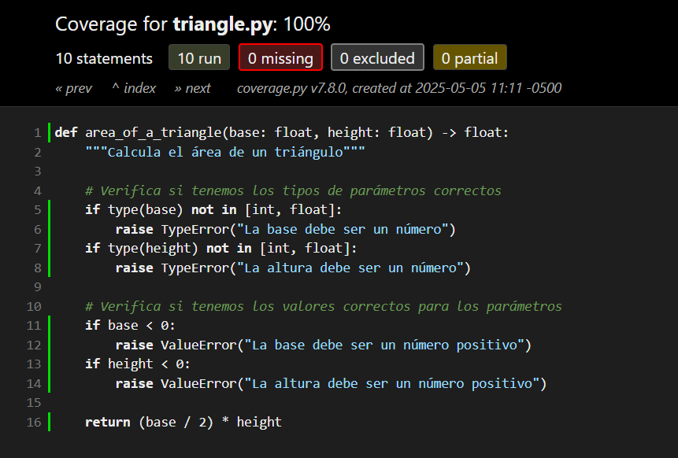

# Pruebas Pytest

## Instalación correcta y sin errores

Seguí el paso de instalación en Windows con python -m pip install pytest pytest-cov y todo se instaló correctamente. No hubo conflictos ni advertencias.

## Primera impresión de pytest

Me gustó lo simple que es escribir y correr pruebas con pytest en comparación con unittest. No necesito clases, y el formato de salida en la terminal es más visual (verde/rojo). Esto ayuda mucho a ver el estado de las pruebas.

## Cobertura de código

La opción --cov=mi_paquete es útil para ver qué tanto del código está cubierto por pruebas. Me pareció especialmente valioso el uso de --cov-report=term-missing porque me mostró exactamente qué líneas no estaban cubiertas.

## Visualización en HTML

Ejecuté pytest --cov=mi_paquete --cov-report=html y se generó una carpeta htmlcov. Me gustó mucho el informe visual en el navegador, ya que se puede ver archivo por archivo lo que falta por cubrir.

## Archivo de configuración

Creé un archivo setup.cfg como se mostró en la actividad y me funcionó sin problemas. Al ejecutar simplemente pytest, ya se aplicaban todas las opciones como -v, --tb=short, y la cobertura. Me parece muy útil no tener que escribir todos esos flags cada vez. También agregué --cov-report=html a este archivo de configuración para que genere el documento html y muestre visualmente la cobertura del código.

El reporte de las pruebas en consola:

La cobertura del código en formato html:

