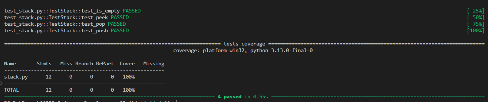
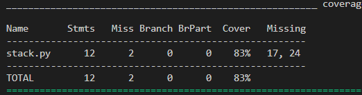
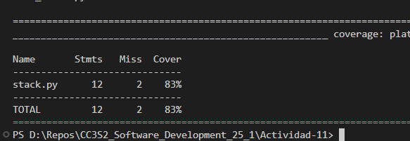

# Actividad 11: Escribir aserciones en pruebas con pytest

**Paso 2: Archivos de prueba**
Los métodos `peek()` y `pop()` necesitan más de un elemento para ser realmente útiles. La clase `Stack` está incompleta en el ejemplo, solo es un esqueleto; asumí que ya estaba implementada.

**Paso 3: Prueba `is_empty()`**
El ejemplo con `self.stack` parece estar hecho para `unittest`, no para `pytest`. Confunde un poco.

**Paso 4: Ejecutar `pytest`**
La opción `-v` ayuda bastante para ver el estado de cada prueba, pase o no pase. El tip de `--exitfirst` es útil si tienes muchas pruebas y quieres detectar errores más rápido.

**Paso 5: Prueba `peek()`**
De nuevo, el ejemplo con `self.stack` sobra o debería explicarse como parte de otro framework.

Sobre el archivo setup.cfg, me interesó poner a prueba la opción --cov=term_missing. Esta opción asegura que el informe muestre cuántas líneas de código están faltando en la cobertura, es decir, aquellas que no fueron ejecutadas por las pruebas. Como la cobertura es perfecta, tuve que quitar tests para ver su efecto:

Si no incluyo la opción --cov=term_missing (y además elimino termporalmente el archivo setup.cfg) el reporte se muestra así:

