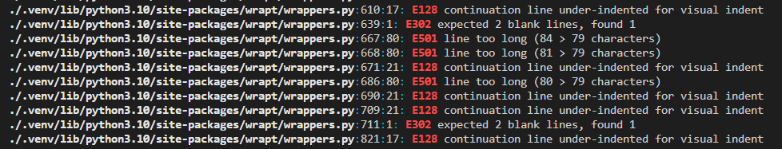
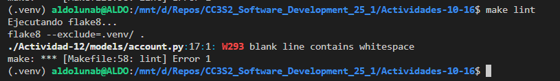
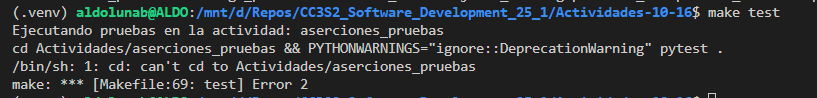
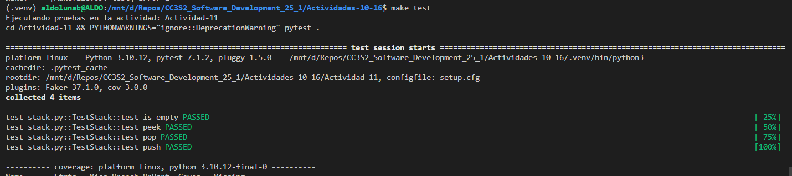

# Actividades 10-16

- Actividad 10: Pytest
- Actividad 11: Asserts
- Actividad 12: Fixtures
- Actividad 13: Mocking
- Actividad 14: Fakes
- Actividad 15: Coverage
- Actividad 16: TDD

Las instrucciones nos dicen que creemos un entorno virtual de Python, pero cuando ejecutamos el comando ``make lint`` observamos que termina analizando también los archivos dentro de nuestro entorno virtual (.venv):



Por eso modificamos esta línea para que flake8 excluya nuestro .venv así:

```bash
flake8 --exclude=.venv/ .
```



Encontré otro error al usar ``make test`` porque mis carpetas no tienen los mismos nombres.



Por eso realicé este cambio:

```bash
ACTIVITY ?= Actividad-11
ACTIVITIES = Actividad-10 Actividad-11 Actividad-12  #...
#...
cd $(ACTIVITY) && PYTHONWARNINGS="ignore::DeprecationWarning" pytest .
```


