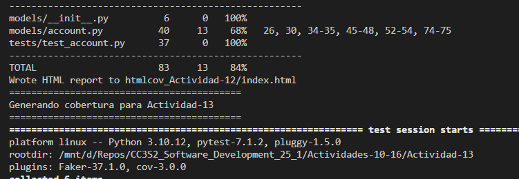

# Actividades 10-16

- Actividad 10: Pytest
- Actividad 11: Asserts
- Actividad 12: Fixtures
- Actividad 13: Mocking
- Actividad 14: Fakes
- Actividad 15: Coverage
- Actividad 16: TDD

Las instrucciones nos dicen que creemos un entorno virtual de Python, pero cuando ejecutamos el comando ``make lint`` observamos que termina analizando también los archivos dentro de nuestro entorno virtual (.venv):


Por eso modificamos esta línea para que flake8 excluya nuestro .venv así:

```bash
flake8 --exclude=.venv/ .
```


Encontré otro error al usar ``make test`` porque mis carpetas no tienen los mismos nombres.


Por eso realicé este cambio:

```bash
ACTIVITY ?= Actividad-11
ACTIVITIES = Actividad-10 Actividad-11 Actividad-12  #...
#...
cd $(ACTIVITY) && PYTHONWARNINGS="ignore::DeprecationWarning" pytest .
```


Probamos el comando ``make test_all`` y vimos que todas las pruebas pasaban. Pero también probamos el comando ``make coverage_individual`` para ver qué nivel de cobertura tiene cada actividad. Descubrimos que algunas actividades tenían código sin cobertura en muchas líneas, por lo que esto nos asegura que hay trabajo por hacer:



No ejecutamos ``make clean`` por eficiencia de tiempo. Observamos que ejecutar todas estas pruebas es un poco lento, y estos archivos temporales de caché y reportes nos ayudan a agilizar un poco el proceso. Pero este comando elimina estos archivos temporales, así que no resulta conveniente ejectuarlo.

Algo adicional que observamos es que todos los archivos de tipo _test.db_ se modificaron luego de ejctuar las pruebas. Este comportamiento indica que las pruebas están generando datos de prueba que persisten, lo cual no tiene mucho sentido. Vamos a abordar esto.
