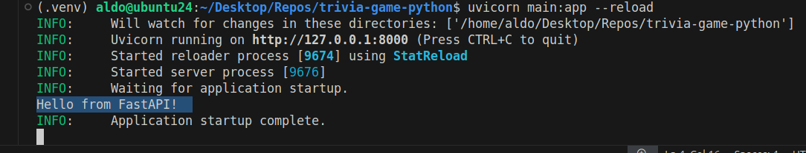
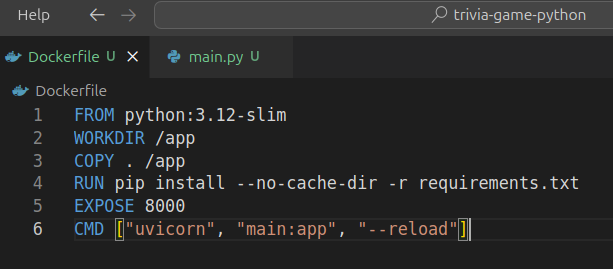
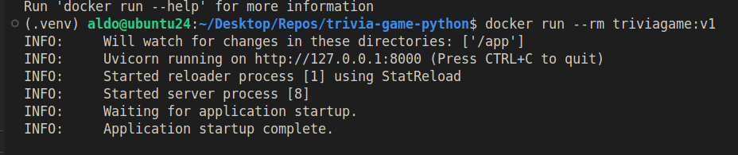

# Prueba de entrada

## Día 1

### Entorno virtual de Python

Para empezar bien con la metodología DevOps, necesitamos desde el principio un entorno aislado para desarrollar nuestra aplicación sin que sea perturbado por eventos externos.

Creamos y nos conectamos al entorno virtual de python (usamos el punto delante en .venv porque así queda más limpio todo como carpeta oculta):

```bash
python3 -m venv .venv
source .venv/bin/activate
```

Desde ahí primero actualizamos la herramienta pip, y luego instalamos los paquetes necesarios para el proyecto:

```bash
pip install --upgrade pip
pip install fastapi, uvicorn, asyncpg, databases
```

Luego guardamos la lista de dependencias en requirements.txt porque queremos replicarlas exactamente en el contenedor (con el Dockerfile que vamos a hacer) para estar seguros de que todo funciona ahí igual que en nuestro entorno virtual.

```bash
pip freeze > requirements.txt
```

Ahora vamos a hacer un pequeño script con FastAPI que muestra un mensaje en consola. Lo ejecutamos con uvicorn (desde el entorno virtual) y hace lo esperado:




Esto mismo debe salir en consola cuando corramos el contenedor en modo interactivo.

### Dockerfile

Para que nuestro contenedor sea ligero, vamos a usar una imagen base de Python 3.12 que sea ligera (slim) como punto de partida para construir el contenedor. Lo demás cae por su propio peso: 

- Dentro del contenedor el estándar es copiar todo el código en una carpeta llamada /app
- Instalamos los requerimientos de dependencias (requirements.txt)
- Finalmente se levanta el servidor web de FastAPI

Todo esto lo escribimos en el Dockerfile:



Tenemos varias cosas a nivel del directorio raíz, así es mejor usar desde el principio un archivo .dockerignore que ignore todo lo que no queremos copiar dentro el contenedor. Usamos la etiqueta triviagame:v1 para la imagen creada:

```bash
docker build -t triviagame:v1 .
```

El mensaje no se muestra, pero esto tiene que ver con la bandera --reload del comando de uvicorn. El servidor se levanta, que es lo importante:


