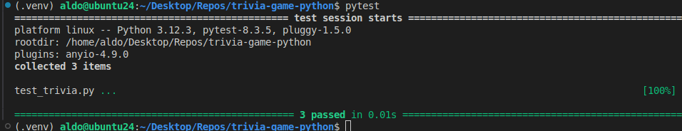

# Prueba de entrada

## Día 1

### Entorno virtual de Python

Para empezar bien con la metodología DevOps, necesitamos desde el principio un entorno aislado para desarrollar nuestra aplicación sin que sea perturbado por eventos externos.

Creamos y nos conectamos al entorno virtual de python (usamos el punto delante en .venv porque así queda más limpio todo como carpeta oculta):

```bash
python3 -m venv .venv
source .venv/bin/activate
```

Desde ahí primero actualizamos la herramienta pip, y luego instalamos los paquetes necesarios para el proyecto:

```bash
pip install --upgrade pip
pip install fastapi, uvicorn, asyncpg, databases
```

Luego guardamos la lista de dependencias en requirements.txt porque queremos replicarlas exactamente en el contenedor (con el Dockerfile que vamos a hacer) para estar seguros de que todo funciona ahí igual que en nuestro entorno virtual.

```bash
pip freeze > requirements.txt
```

Ahora vamos a hacer un pequeño script con FastAPI que muestra un mensaje en consola. Lo ejecutamos con uvicorn (desde el entorno virtual) y hace lo esperado:


Esto mismo debe salir en consola cuando corramos el contenedor en modo interactivo.

### Dockerfile

Para que nuestro contenedor sea ligero, vamos a usar una imagen base de Python 3.12 que sea ligera (slim) como punto de partida para construir el contenedor. Lo demás cae por su propio peso: 

- Dentro del contenedor el estándar es copiar todo el código en una carpeta llamada /app
- Instalamos los requerimientos de dependencias (requirements.txt)
- Finalmente se levanta el servidor web de FastAPI

Todo esto lo escribimos en el Dockerfile:


Tenemos varias cosas a nivel del directorio raíz, así es mejor usar desde el principio un archivo .dockerignore que ignore todo lo que no queremos copiar dentro el contenedor. Usamos la etiqueta triviagame:v1 para la imagen creada:

```bash
docker build -t triviagame:v1 .
```

El mensaje no se muestra, pero esto tiene que ver con la bandera --reload del comando de uvicorn cuando el contenedor se ejecuta en modo interactivo. El servidor se levanta, que es lo importante:


### docker-compose

Ahora que ya tenemos un Dockerfile para generar la imagen personalizada de nuestra aplicación FastAPI, podemos usarla con otras imagenes para conjuntamente levantar servicios (contenedores) que se comuniquen entre sí. Definimos un archivo docker-compose.yml para levantar el el servidor web y una base de datos PostgreSQL. Un detalle importante de este archivo es que debemos hacer que el servidor web dependa de la base de datos, de forma que el servidor espere a que al base de datos esté lista. Esto se logra así:

```yaml
services:
  web:
    ...
    depends_on:
        - db
  db:
    ...
```

Para conectarnos a la base de datos usamos una URL muy sencilla como `postgresql://user:123@db:5432/triviadb` que especifica el usuario, la contraseña y el nombre de la base de datos. Pero la opción más segura sería guardar esta URL en un archivo .env que guarda variables de entorno.

Para asegurarnos de que realmente el servidor web se está conectando a la base de datos, usamos los siguientes manejadores de eventos `startup` y `shutdown`, desde los cuales imprimimos en consola para verificar que el servidor se conectó o se desconectó de la base de datos.

Por último, dado que estamos usando FastAPI a través de Uvicorn, para que el servidor pueda conectarse con el exterior no nos basta con `uvicorn main:app --reload`. Aquí el servidor solo se escucha a sí mismo, escucha la interfaz localhost. Necesitamos que el servidor pueda escuchar todas las interfaces de red, y esto se hace escuchando al 0.0.0.0:

```bash
uvicorn main:app --host 0.0.0.0 --port 8000 --reload
```

Esto se refleja en el Dockerfile con esta instrucción:

```Dockerfile
CMD ["uvicorn", "main:app", "--host", "0.0.0.0", "--port", "8000","--reload"]
```

Finalmente, tras ejecutar el docker-compose...

```docker compose up --build```

... podemos disfrutar de la conexión de la base de datos...


... y del mensaje JSON que podemos visualizar en el navegador de nuestra máquina host:


### Guardar cambios en git

Por último, guardamos los cambios en la rama features/estructura-inicial (posteriormente, lo agregaremos a la rama de integración llamada develop)


## Día 4




## Día 6


